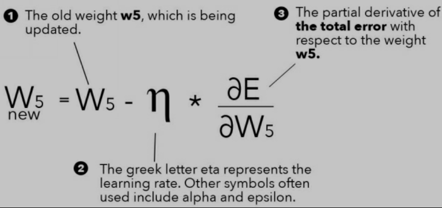

What are hyperparameters? 
They are fine tuning knobs that can be tweaked to help a network successfully train. 

Required Hyperparameters: 
* Total number of input nodes.
* Total number of hidden layers.
* Total number of hidden nodes in each hidden layer. 
* Total number of output nodes. 
* Weight values. 
* Bias values. 
* Learning rate. 

Optional Hyperparameters
* Learning rate schedule ( learning rate decay )
* Momentum
* Mini batch size. 
* Weight decay
* Dropout. 

> Input Node
> Input to the network
> Numerical
> Each node => A feature 
> Each node => One dimension

> Hidden Layer
> Layer b/w Input and Output layer
> Can be single or multiple. 
> How  many? (out of scope) refer [[Practical_way_to_train_rbm]]

> Hidden Node
> Node in a hidden layer
> General rules of thumb and trial error to choose the number of hidden nodes.
> More info refer [[Practical_recom_gradient_based_training|Practical Recommendations for Gradient based training of deep architectures]]

> Output Node
> Node in output layer. 
> Single or multiple depending upon the objective of the network. 

> Weight Value
....
....
....

--- 
---

### Updating the weights. 

#### What is gradient descent?

> Optimization method; Find combination of weights that will minimize the error in the output of the network; Methaphor -> "It is how we turn the dials to fine tune the network"
> Learning rate -> Speeds up or slows down how quickly an algorithm learns. ~ 0.0001 to 1. ; Determines the size of the step an algorithm takes when moving towards the global minimum. 
> Analogy -> Gradient descent is like a person hiking down a mountain.

Reference: 
>    ![[An overview of gradient descent optimization algorithms.pdf]]

##### Gradient Descent Methods

###### Batch Gradient Descent (Full Batch)
* Summing the gradients for *every* training set element and then updating the weights. 
* eg. if there are 10000 images, then update of the weights will not occur until after the gradients of all 10000 images have been calculated and combined. 

###### Stochastic Gradient Descent (SGD / Online)
* Weights in the network are modified after every training set element. 
* Shuffle the inputs to avoid the network getting biased either after the every epoch or once before the training. 
* Can bounce around the global minimum 

###### Mini Batch Gradient Descent
* Summing the gradients for multiple training set inputs and then updating the weights. 
* Size of the mini batch is a hyperparameter. 
* Most popular

##### Updating Weight
###### General Weight Update Equation 
> ![[general_weight_update.png.png]]

###### Batch Training Weight Update Equation

![[Pasted image 2.png]]

