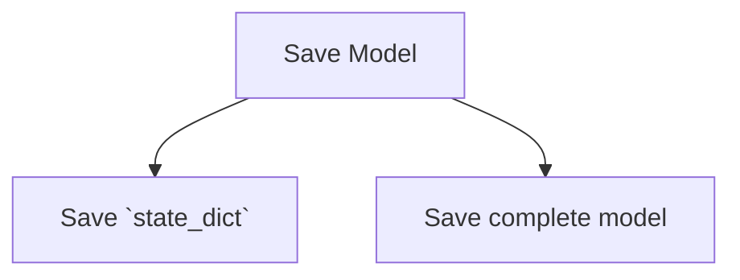

% Save and Load Pytorch models

## Save and Load Models

Common convention is to save the model data in a file with extension `.pt`  or `.pth`

There are two methods:



### Save model with state_dict
- Saves only the models learned parameters
- Recommended way of saving the model

```python
model = models.vgg16(pretrained=True)
torch.save(model.state_dict(), 'model_weights.pth')

model = models.vgg16() 
model.load_state_dict(torch.load('model_weights.pth'))
model.eval()
```

### Save Complete Model
- Intiutive syntax and less code
- Disadvantage
	- The serialized data is bound to the specific classes and the exact directory structure used when the model is saved. 
	- Your code can break in various ways when used in other projects or after refactors.
	
```python
torch.save(model, 'model.pth')
model = torch.load('model.pth')
```


## Resources
1. [ Save and Load model state](https://pytorch.org/tutorials/beginner/basics/saveloadrun_tutorial.html)
2. [Save and load model](https://pytorch.org/tutorials/beginner/saving_loading_models.html)