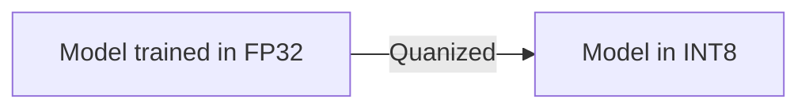

% Quantization

#quantization #DeepLearning #PyTorch

----
## Introduction
- Techniques for performing computations and storing tensors at lower bitwidths than floating point precision.
- Quantized model executes some or all of the operations on tensors with integers rather than floating point values
- Supports INT8 quantization
	- 4x reductions in model size
	- 4x reduction in memory bandwidth requirements
	- 2 to 4 times faster compared to FP32 compute
- Only forward pass is supported for quantized operators

----

## Approaches

- Convert trained model

- Quanization aware training
	- Models quantization errors in both forward and backward passes using fake-quantization modules.
	- Computation is carried out in floating point
	- Conversion function to convert to lower precision is available at the end of the training

---

## Quantization Modes
1. Eager Mode Quantization
2. FX Graph Mode Quantization

### Eager Mode Quantization

## Resources
- [PyTorch Blog Post](https://pytorch.org/blog/introduction-to-quantization-on-pytorch/)
- [PyTorch Documentation](https://pytorch.org/docs/stable/quantization.html)
- [PyTorch Dynamic Quantization Tutorial](https://pytorch.org/tutorials/recipes/recipes/dynamic_quantization.html)
- [PyTorch Static Quantization Tutorial](https://pytorch.org/tutorials/advanced/static_quantization_tutorial.html)
