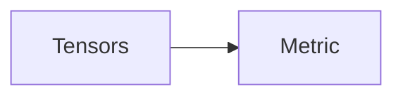

% Torchmetrics

TorchMetrics is a collection of 80+ PyTorch metrics implementations and an easy-to-use API to create custom metrics.

`pip install torchmetics`

```mermaid
flowchart LR
A[Tensors] --> B[Metric]
```