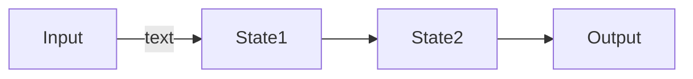
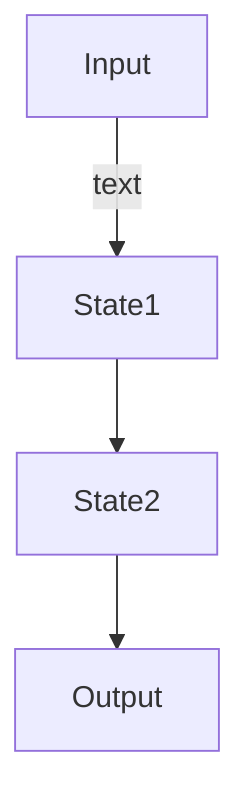
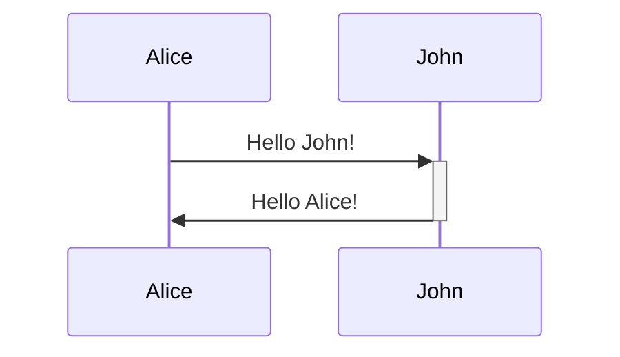

% Draw diagrams in markdown 

- Flowchart 

Left to Right Flow chart

```mermaid
flowchart LR
	A[Input] --text--> B[State1];
	B --> C[State2];
	C --> D[Output];
```

Top to Bottom flow chart

```mermaid
flowchart TD
	A[Input] --text--> B[State1];
	B --> C[State2];
	C --> D[Output];
```

- Sequence Diagram

```mermaid
sequenceDiagram
	Alice->>+John: Hello John!
	John->>-Alice: Hello Alice!
```
